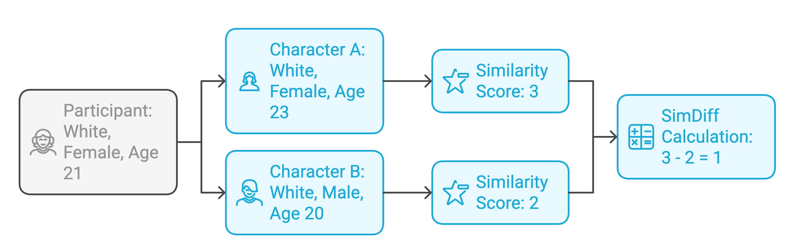
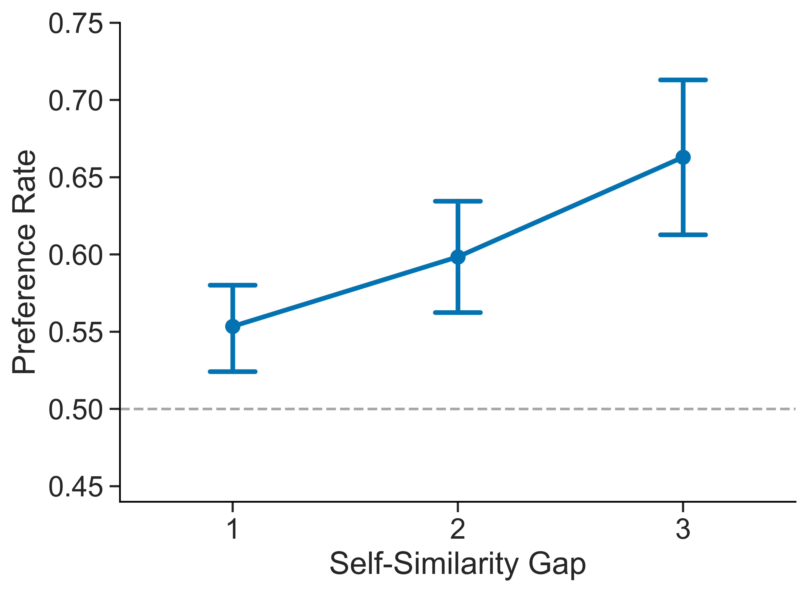
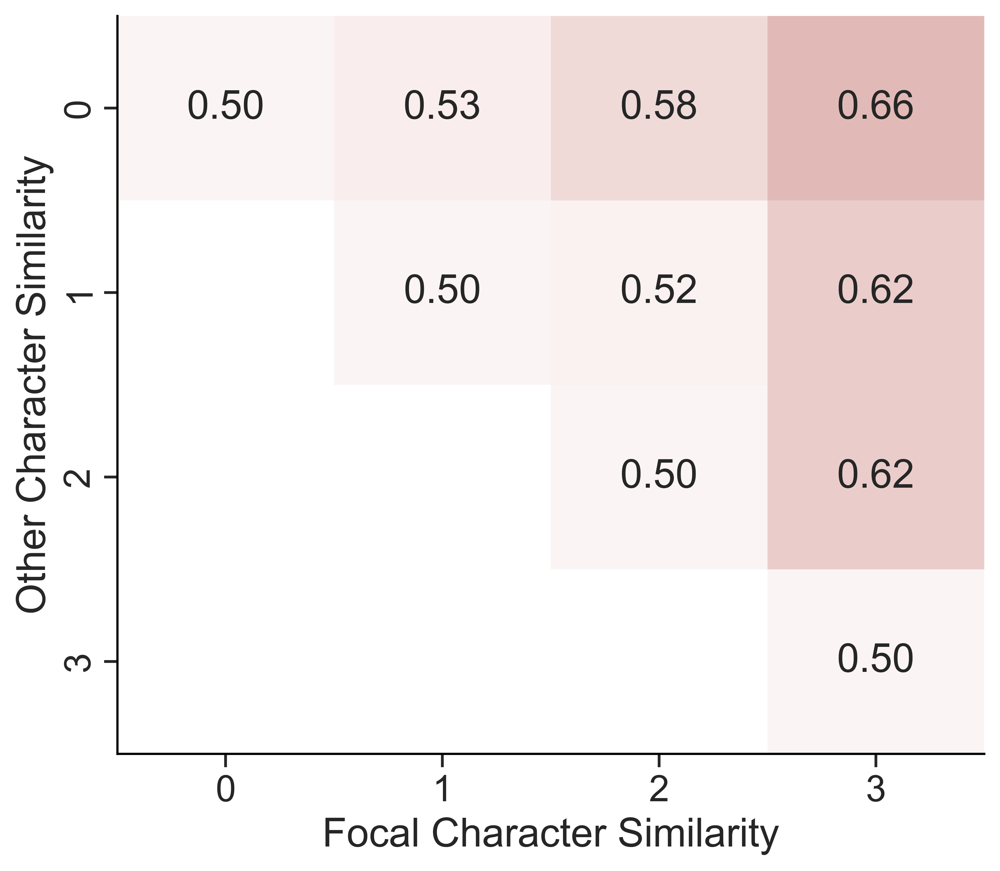
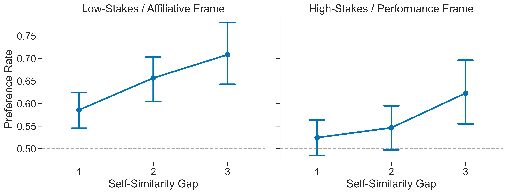
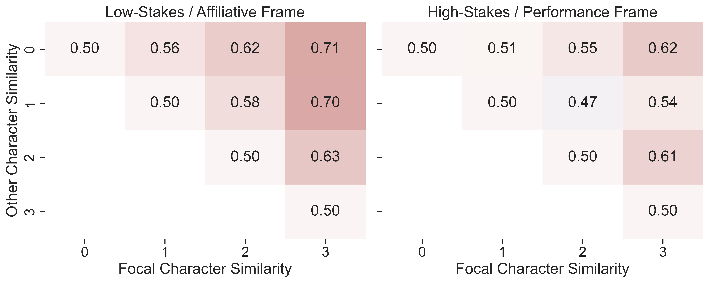
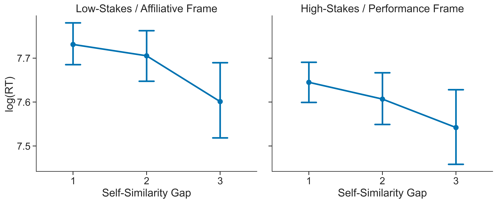
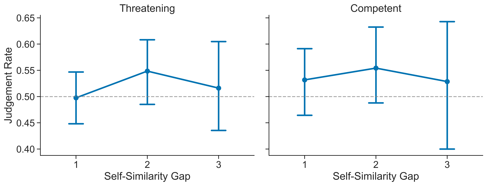

# Abstract

Homophily -- the preference for similar others -- is a basic principle of social organization [@mcpherson2001birds], yet observational studies show that the extent of its expression can depend on context and features [e.g., @montoya2008actual; @alhazmi2017empirical; @launay2015playing].
Clarifying when the bias shifts requires experimental control to separate preference from opportunity [@currarini2010identifying].
We introduce a rapid two-choice teammate-selection task that uses Chicago Face Database images [@ma2015chicago] and independently manipulates task context and a self-similarity gap: the difference in how many demographic traits each face shares with the participant (e.g., 3 vs 1 → gap = 2).
In a low-stakes/affiliative frame ("make collaboration enjoyable"), each unit increase in the gap raised preference rates by 6 percentage points and sped decisions by 170 ms (ps \< .05).
Both effects were markedly smaller in a high-stakes/performance frame ("maximize chances of winning"; gap × stakes ps \< .05).
The same data exhibited baseline preferences for certain demographic groups, independent of self-similarity.
Trait-norm analyses indicated that faces rated as more threatening were avoided only in low stakes, and a follow-up task asking participants to pick the more competent or threatening face showed no influence of the self-similarity gap.
Together, these follow-up analyses suggest that the framing effect is not a global shift in selectivity and is not explained by self-similarity directly biasing threat or competence judgments. 
Overall, the results are consistent with a context-dependent account of homophily: demographic self-similarity strongly guides choices under affiliative goals and is dampened when performance stakes rise.
Our three-minute paradigm offers an efficient, controlled tool for mapping how decision context and homophily interact to shape team formation.

# Introduction

Homophily -- the preference for similar others -- has been called "the first law of social organization" because it surfaces in virtually every kind of human network [@mcpherson2001birds].
Large-scale studies document this bias across relationships [@kossinets2009origins; @currarini2010identifying], elite hiring decisions [@rivera2012hiring], and startup teams [@ruef2003structure], and confirm its robustness across cultures [@byrne1971ubiquitous; @heine2002interjudge] and experimental contexts [@montoya2008actual; @montoya2013meta].
Its reach is also multidimensional: people sort not only by visible demographics but also by shared values and backgrounds [e.g., @wimmer2010beyond; @dehghani2016purity].
Because observed homophily can reflect both opportunity (who is nearby) and choice (an active preference for like others), separating the two is crucial: work that controls for opportunity still finds a substantial preference component [e.g., @currarini2010identifying; @rivera2012hiring].
Choosing similar others can sometimes ease early coordination and trust, but also reinforce groupthink and entrench inequality [@ertug2022does; @stallen2023partner].
That tension makes it important to identify when homophily is most likely to guide teammate selection.

Despite its ubiquity, the strength of choice homophily fluctuates markedly across contexts and tie types.
<!-- FIXME: is "choice homophily" the term we want to use? --> 
Within the same corporate networks, for example, strong friendship ties show clear same-race and same-sex bias while instrumental advice ties do not [@lincoln1979work; @hinds2000choosing].
In schools, racial similarity is strongest in best-friend dyads but weakens or reverses in looser acquaintance ties as classroom diversity rises [@mcmillan2022strong; @mcmillan2022worth].
Field evidence likewise diverges: startup founders cling to same-gender and same-ethnicity partners despite financial stakes [@ruef2003structure], whereas competitive gaming teams all but ignore country similarity once skill cues are available [@alhazmi2017empirical].
More focused meta-analyses probing choice homophily in field and lab settings find that the strength of the bias can depend on factors like amount of pre-existing interaction, the centrality of the information available, and the salience of applicable traits [@montoya2013meta; @montoya2008actual].
<!-- FIXME: is "choice homophily" the term we want to use? --> 
The features that people prefer self-similar others for also vary.
For example, people disprefer negative traits in others even when they share those traits themselves [@novak1968rejection; @ajzen1974effects].
These findings suggest that homophily waxes in some situations and wanes in others, setting the stage for a more nuanced account of the conditions under which the bias is expressed.
<!-- FIXME: this is a narrow interpretation of the evidence in this review. A broader perspective might be that a range of priorities compete with homophily. -->

A promising framework for interpreting variation in homophily is the rewards-of-interaction perspective [@berscheid1969interpersonal; @ajzen1974effects].
According to this perspective, people gravitate to others from whom they expect benefits, and this expectation is shaped by the information available about potential affiliates.
Similarity functions as a shorthand for such rewards for many reasons, including reduced coordination costs, potential for self-validation, and the avoidance of social friction [@reagans2001networks; @ajzen1974effects; @kaplan1973information].
If self-similarity serves as a cue for prospective rewards, its pull should strengthen when those rewards are central to success and weaken when other benefits less closely tied to self-similarity, such as unique skills or complementary resources, matter more.
Thus the strength of homophily should vary with the context and framing of the task at hand.

An information-processing framework integrates these observations into a broader account of social judgment [@montoya2013meta; @kaplan1973information].
At root, it posits that each attribute contributes valence (is what it signals good or bad?), receives a weight (how much it matters), and influences attraction only when salient [@montoya2013meta].
The rewards-of-interaction principle complements this framework by stressing that both valence and weight pivot on goal relevance: cues that signal rewards for the task context at hand gain high weight, whereas less relevant cues are down-weighted.
This logic also clarifies why a stable intrinsic component of homophily persists: most people evaluate their own attributes positively [@zell2020better], and minimal-group experiments show a liking boost for arbitrary ingroups even without clear prospective payoffs present [@tajfel1979integrative; @yamagishi1999bounded].
An instrumental component, however, should strengthen or weaken as the prospective utility of self-similarity rises or falls.
Mapping when self-similarity becomes more or less predictive of relational outcomes frames the agenda for the present research.

The extensive work on rapid face impressions offers a concrete test bed for our framework.
Observers can extract broad social signals (e.g., trustworthiness, dominance, competence) from a neutral face in under 100 ms, and those intuitions influence trust games, personnel decisions, and even national elections [@willis2006first; @zebrowitz2017first; @olivola2010elected].
Warmth–competence models of social judgment [@fiske2007universal] and valence–dominance models of face evaluation [@oosterhof2008functional] both organize these impressions around a target's intent (friend vs. foe) and capacity to enact that intent.
Prior work further shows that facial resemblance and other self-similarity cues can shift impressions such as trustworthiness and attractiveness [@debruine2002facial; @nakano2022you; @debruine2004facial].
These findings suggest that self-similarity may matter partly because it overlaps with cues linked to different relational rewards, and the relevance of those cues should depend on the task context.

Chicago Face Database trait norms therefore provide a useful way to test whether the framing manipulation changes which facial cues predict teammate choice, helping narrow the interpretation of any framing effect without assuming that the present studies identify its mechanism directly [@ma2015chicago].

The constraints and affordances highlighted above point to three key requirements for a task that can efficiently disentangle the effects of self-similarity and task framing on team formation.
First, evidence of context-dependent homophily must be disentangled from mere opportunity: participants should face the same exposure set while preference cues are manipulated.
Second, to test goal-dependent weighting, self-similarity and task frame must vary orthogonally within or across individuals.
Third, because trait inferences and self-similarity signals arise early in social perception, the task should capture decisions quickly and repeatedly, permitting fine-grained estimates of effect size.
A design that meets these three requirements of controlled exposure, crossed manipulations, and high trial density would provide a clean test of when self-similarity is more or less predictive of teammate choice.

In the present study, we introduce a three-minute, two-alternative teammate-selection task built from Chicago Face Database images [@ma2015chicago] that meets these criteria.
On each trial, participants choose between two faces that differ in a self-similarity gap: the number of shared demographic traits with the chooser (0–3).
A between-participants frame manipulates goals and stakes while otherwise holding the prospective task constant.
In a low-stakes/affiliative frame, participants are asked to select teammates who will "make collaboration productive and enjoyable"; in a high-stakes/performance frame, they are asked to select teammates who will "maximize their chances of winning".
We record binary choice and decision time, then use CFD trait norms alongside participant and decision data to test whether the facial cues associated with choice shift across frames.
In a follow-up experiment, we test one simpler account by asking whether self-similarity predicts relative competence and threat judgments in a neutral task outside the teammate-selection context.
Together, these experiments validate a novel paradigm for testing context-dependent homophily and use it to test whether the weight placed on self-similarity changes across frames and narrow plausible interpretations of that framing effect.

# Experiment 1: Self-Similarity Gap and Task Framing

@fig-gap provides an overview of the task and the key predictor.

::: {#fig-gap}


Overview of the experimental design and self-similarity gap calculation.
On each trial the participant chose between two candidates drawn from an eight-face pool.
A self-similarity score was computed for each face as the count of demographic traits (ethnicity, gender, age bracket) shared with the participant.
In the example shown, Character A shares three traits and Character B shares two; the self-similarity gap is therefore \|3 − 2\| = 1.
:::

## Stimuli and Self-Similarity Gap Manipulation

Face images were licensed from the Chicago Face Database (CFD) and the CFD-India subset.
Only neutral-expression photos were used and resized to a common resolution.
Each image carried CFD metadata for age, gender, and ethnicity as well as norming data for a range of face-based features.
@ma2015chicago provides a detailed description of the CFD and its norming procedures.
Ethnicity labels were restricted to five groups with ample coverage -- Black/African American, East Asian, Latino/Hispanic, South Asian, and White -- to maintain balanced stimulus pools.
Age was binned into four brackets (18-24, 25-31, 32-38, 39-45) to equalize face counts across brackets.

For every participant an eight-image pool was constructed so that exactly two faces shared 0, 1, 2, or 3 of the participant's demographic traits (ethnicity, gender, age bracket).
Within each eight-image pool there are $\binom{8}{2}=28$ unique face pairs, so each participant completed 28 choice trials.
The self-similarity gap [@fig-gap], defined as the absolute difference in the number of participant-shared traits between the left and right faces, served as the primary predictor in all analyses.

## Trial Interface

On each trial two candidate faces appeared side by side with demographic labels (race/ethnicity, sex, age) underneath.
Left-right placement was randomized.
Participants selected a face by clicking a "Left" or "Right" button located below the images, and a one-line reminder of the task goal appeared beneath the buttons.
Choice and response time were recorded from stimulus onset to button click.

## Participants

One hundred individuals aged 18-45 were recruited on Prolific.
The sample was quota-balanced so that each of five ethnic categories (Black/African American, East Asian, Latino/Hispanic, South Asian, White) comprised 20 percent of participants and each gender comprised 50 percent.
Participants were paid \$0.50 for a 3-5-minute session (approximately \$10/hour).
All participants completed the study and were retained for analysis.

## Procedure

Participants first reported their own demographics and rated self-perceived competitiveness on a 0-10 slider (not analyzed).
The eight-image pool was generated immediately after this survey.
All procedures were approved by the university IRB, and participants were debriefed and compensated in full.

Participants were randomly assigned to one of two task framing conditions.
The low-stakes/affiliative frame described a relaxed community project and instructed participants to choose teammates who would make collaboration enjoyable and productive.
The high-stakes/performance frame described a grant competition and instructed participants to choose teammates who would maximize the team's chance of winning.
For immersion, participants were told they had been selected as team leader and could state their teammate preferences.
Before the first trial a three-second loading screen displayed a progress bar and the message "One moment. We are sorting you into a lobby." Full wording for both instruction sets is provided in the Supplementary Materials.

Participants then completed the 28 choice trials as described above.
After the final trial they completed a deception check asking whether they expected a real follow-up game.
Responses were recorded but not used as exclusion criteria.

## Results

### Data Preparation

Raw data contained one record per trial (100 participants × 28 trials = 2,800 rows).
For modeling we expanded each trial into two mirrored rows: one treating the left face as the focal candidate and one treating the right face as focal.
This duplication (total 5,600 analytic rows) removes any bias from the arbitrary left/right assignment and lets us express the mixed-effects models with a single binary outcome: $\text{Preference} = 1$ if the focal face was chosen, $0$ otherwise.
Each record contained the task framing condition (0 = affiliative, 1 = performance), a raw/signed self-similarity gap (ranging from -3 to +3), a binary choice flag (1 = focal face chosen), and log-transformed reaction time (after trimming \< 150 ms and \> 10 s).
Face metadata (ethnicity, gender, CFD trait norms) and participant demographics were merged for subsequent models and robustness checks.

### Descriptive Overview

::: {#fig-overall layout-ncol="2"}




Preference rate as a function of the similarity between compared characters and the participant, measured across all participants and conditions.
**Left**: Preference rate for the more-similar teammate as self-similarity gap increased.
Error bars represent bootstrapped 95% confidence intervals.
Horizontal dashed line indicates chance level (50%).
**Right**: Preference rates across counts of shared features to each participant for compared character.
Color intensity indicates the probability of selecting the more-similar character, with darker colors indicating higher probabilities.
Cells where focal character shares fewer features with participant than the competitor are not shown.
:::

::: {#fig-pointsplit layout-ncol="1"}


Point plots showing the preference rate for the more-similar teammate across all participants as self-similarity gap increased, split by framing condition (low-stakes/affiliative vs. high-stakes/performance).
Error bars represent bootstrapped 95% confidence intervals.
Horizontal dashed line indicates chance level (50%).
:::

::: {#fig-heatmapsplit layout-ncol="1"}


Preference rates across counts of shared features to each participant for compared character, split by framing condition (low-stakes/affiliative vs. high-stakes/performance).
Color intensity indicates the probability of selecting the more-similar character, with darker colors indicating higher probabilities.
Cells where focal character shares fewer features with participant than the competitor are not shown.
:::

::: {#fig-rtpointsplit layout-ncol="1"}


Point plots showing the mean log reaction time for the more-similar teammate across all participants as self-similarity gap increased, split by framing condition (low-stakes/affiliative vs. high-stakes/performance).
Error bars represent bootstrapped 95% confidence intervals.
Horizontal dashed line indicates chance level (50%).
:::

First, we seek to characterize the overall effect of demographic self-similarity on team formation.
Participants' tendency to choose more-similar teammates is visualized using both point plots and heatmaps.
Point plots show the probability of selecting the focal character as a function of self-similarity gap, which is the absolute difference in the number of demographic features shared with the participant between the focal character and the competitor.
For visualization purposes, the focal character is always the more-similar of the two, restricting self-similarity gap values to the non-negative range (0, 1, 2, 3).
Heatmaps represent preference probabilities for each possible combination of the number of features the participant shares with the focal character and with the competitor, yielding a 4×4 grid of probabilities where the top-right cell corresponds to the maximum self-similarity gap of 3.

@fig-overall summarises the aggregate pattern.
The point plot (left) shows a monotonic rise in the probability of selecting the more-similar candidate as the self-similarity gap increases from 0 to 3, with 95% bootstrap CIs well above chance at every level and a peak preference of 0.66 at the maximum gap.
The accompanying heat-map (right) confirms that this gradient holds across the full 4 × 4 matrix of similarity counts.

When the data are split by framing condition (@fig-pointsplit and @fig-heatmapsplit), the homophily gradient is visibly steeper under the low-stakes / affiliative frame than under the high-stakes / performance frame.
In the affiliative condition, preference for the more-similar face is above chance at every gap and rises steadily with each additional shared trait.
In the performance condition the increase is muted and less consistent, suggesting that participants down-weight self-similarity when performance incentives are foregrounded.

@fig-rtpointsplit shows that decision speed mirrors the preference data: selections become faster as the self-similarity gap widens, but chiefly in the affiliative frame.
When the task emphasises performance, reaction times less consistently decrease with increasing self-similarity gap, suggesting that self-similarity is less decisive in the high-stakes context.

### Mixed Effects Logistic Regression

| Fixed Effect | Estimate ($\beta$) | SE | z | p | Odds Ratio exp($\beta$) |
|:---------------------|---------:|---------:|---------:|---------:|---------:|
| (Intercept) | 0.010 | 0.0639 | 0.163 | 0.871 | 1.01 |
| Self-Similarity Gap | 0.358 | 0.0735 | 4.87 | $1.1 \times 10^{-6}$ | 1.43 |
| High-Stakes (vs. Low-Stakes) | –0.025 | 0.0723 | –0.350 | 0.727 | 0.98 |
| Gap × Frame (Interaction) | –0.140 | 0.0591 | –2.37 | **0.018** | 0.87 |

: Mixed-effects logistic model predicting choice of the more-similar teammate. Odds ratios \> 1 indicate higher odds of choosing the focal face. {#tbl-pref}

| Fixed Effect        | Estimate ($\beta$) |     SE |     $t$ |                   $p$ |
|:------------------|---------------:|------------:|------------:|------------:|
| (Intercept)         |              7.780 | 0.0429 |  181.26 | $< 2 \times 10^{-16}$ |
| Self-Similarity Gap |           $-0.040$ | 0.0118 | $-3.43$ |           **0.00061** |

: Mixed-effects linear model predicting log-transformed reaction time. {#tbl-rt-fixed}

To more completely test whether demographic self-similarity predicts teammate preference and whether this effect is modulated by contextual framing, we fit a generalized linear mixed-effects model (logistic) with self-similarity gap, framing condition (casual vs. competitive), and their interaction as fixed effects.
In line with prior definitions, self-similarity gap was calculated as the number of demographic features (race, sex, and age) that the chosen character shared with the participant relative to the unchosen alternative.
Here, the self-similarity gap was allowed to take on negative values when the unchosen character shared more features with the participant than the chosen character.
By contrast, a higher self-similarity gap indicates that the selected character was more demographically similar to the participant.
The model included a random intercept for character to capture baseline differences in character popularity independent of demographic attributes.
Importantly, we also introduced a random slope for self-similarity gap at the participant level, allowing the strength of homophily to vary by individual.
The model formula was:

::: {#eq-mixed-effects}
$$
\text{Preference} \sim \text{Self-Similarity Gap} \times \text{Framing Condition}
$$
$$
+ (1 \mid \text{Character}) +\bigl(0 + \text{Self-Similarity Gap} \mid \text{Participant}\bigr)
$$
:::

Specifying a participant-level slope for the self-similarity gap term yielded a substantially improved fit over a model without the term (AIC = 7210.4, BIC = 7243.5 → AIC = 6933.9, BIC = 6973.6), and the final model described meaningful variance in both random effects.
The model confirmed that participants were significantly more likely to choose characters who were demographically similar to themselves ($\beta$ = 0.358, p == $1.1 \times 10^{6}$).
A significant interaction effect between self-similarity gap and framing condition was also found ($\beta$ = -0.14, z=-2.37, p = 0.018), suggesting that participants were less influenced by self-similarity under a high-stakes/performance framing compared to a low-stakes/affiliative framing.

The random slope variance for self-similarity gap was substantial (Var = 0.193, SD = 0.439), indicating that participants differed in how strongly they weighted demographic self-similarity when selecting teammates.
Some exhibited strong homophily, while others showed weaker or even reversed preferences.
The random intercept variance for character also remained large (Var = 0.636, SD = 0.798), suggesting persistent character-level biases unrelated to self-similarity.

As a follow-up analysis, we decomposed the summed gap into separate race-, age-, and gender-match differences and fit an otherwise analogous logistic mixed model with participant-level slopes for each component (see @tbl-multisimdiff-components).
Race- and age-match differences both positively predicted selection of the focal candidate ($\beta$s = 0.89 and 0.60, ps \< .05), whereas the gender-match term was smaller and less precise ($\beta$ = 0.46, p = .12).
This suggests that the aggregate self-similarity effect was not reducible to race matching alone, although the clearest contributions came from race and age rather than gender.

We analysed decision speed with a linear mixed model in which log-transformed RT (milliseconds) was regressed on the signed self-similarity gap, with a random intercept for each participant.
Character-level random effects were not included due to low variance in the character intercepts.

$$
log(\mathrm{RT}) \sim \text{Self-Similarty Gap} + ( 1\mid\text{Participant})
$$

As @tbl-rt-fixed shows, the gap coefficient was negative ($\beta$ = –0.040 ± 0.012 SE, t = –3.43, p = .00061).
Back-transforming the estimate, each one-unit increase in gap multiplied RT by exp(–0.040) $\approx$ 0.96 -- about a 4% reduction in decision time per additional shared trait difference.
Given a baseline of \~2.4 s (exp $\beta_0 \approx 2 396$ ms), this translates to roughly 90–100 ms faster responses for gap = 2 versus gap = 1, and \~180 ms for gap = 3 versus gap = 1.
Thus, the same homophily cue that boosts choice probability also quickens decisions, consistent with the idea that larger self-similarity gaps make the choice easier to resolve.
Participant intercepts further showed appreciable heterogeneity (Var = 0.145, SD = 0.381), indicating baseline speed differences across individuals.

### Preferences Independent of Self-Similarity

In our mixed-effects modeling of teammate preference, we observed a substantial amount of variability in the random intercept for character, indicating that some characters were consistently preferred or avoided by participants, independent of their demographic self-similarity.
We examined this baseline preference for characters through two perspectives.
First, we assessed whether participants exhibited general preferences for specific demographic groups, independent of self-similarity, such as specific age groups or ethnicities.
This could explain character-level biases in terms of general attraction or aversion to certain groups, rather than a specific preference for self-similarity.
Second, we applied CFD trait-norms to assess whether participants preferred characters that tended elicit specific trait impressions, such as competence or threat.
This could indicate that participants were selecting characters based on perceived attributes rather than or as part of a broader tendency toward homophily.

### Demographic Preferences

To assess demographic preferences independent of self-similarity, we fit a demographic-only mixed-effects model in which choice was predicted by the candidate's race, age, and gender, each crossed with framing condition and controlling for a random intercept for character:

$$ 
\text{Preference} \sim 
\bigl(\text{Race} + \text{Age} + \text{Gender}\bigr) \times \text{Frame} + (1 \mid \text{Character})
$$

where the reference category is a Black, female face at the sample-mean age, shown in the affiliative frame.
Character ID remained as a random intercept (Var = 0.56, SD = 0.75).
The fixed-effects estimates are summarised in @tbl-demo-fixed.

| Fixed Effect | Estimate ($\beta$) | SE | $z$ | $p$ |
|:---|---:|---:|---:|---:|
| (Intercept) | 1.413 | 0.281 | 5.02 | $5.2\times10^{-7}$ |
| East-Asian | 0.211 | 0.183 | 1.15 | .25 |
| Latino | –0.300 | 0.202 | –1.49 | .14 |
| South-Asian | –0.394 | 0.194 | –2.03 | **.042** |
| White | –0.356 | 0.176 | –1.99 | **.047** |
| High-Stakes / Performance frame | –0.471 | 0.318 | –1.48 | .14 |
| Age (per year) | –0.0349 | 0.0074 | –4.74 | $2.2\times10^{-6}$ |
| Male (vs. female) | –0.295 | 0.121 | –2.43 | **.015** |
| South-Asian × High-Stakes | 0.489 | 0.233 | 2.10 | **.036** |
| all other Race×Frame and trait×Frame interactions | — | — |  | $>.12$ |

: Fixed effects from the demographic-only model predicting choice of the focal face. {#tbl-demo-fixed}

South-Asian and White faces were selected less often than Black faces (odds ratios $\approx$ 0.67 and 0.70, respectively; ps \< .05), whereas East-Asian and Latino faces did not differ reliably from the reference category.
Each additional year of target age lowered the odds of selection by about 3% ($\beta$ = –0.035, p \< .001), indicating a general preference for younger teammates.
Finally, male faces were chosen less frequently than female faces ($\beta$ = –0.30, p = .015).

Framing the task as high-stakes had no impact on these baseline race, age, or gender effects, apart from a modest attenuation of the South-Asian disadvantage (interaction $\beta$ = 0.49, p = .036).
Because these demographic biases remain essentially stable across frames, the Gap × Frame interaction observed in the homophily model must reflect a genuine shift in the weighting of self-similarity, not a wholesale change in attraction or aversion to particular groups.
A supplementary extension adding candidate-race × participant-race interactions indicated that these apparent race disadvantages were not shared uniformly across participant groups.
The South-Asian-face disadvantage was concentrated among Black participants, whereas the White-face disadvantage appeared mainly among Black and South-Asian participants (see @tbl-demo-participant-race; excluding one Multiracial and one Other participant).

### Trait Norms

The main framing manipulation varied both goal type and stakes simultaneously: the affiliative condition was also low-stakes, whereas the performance condition was also high-stakes. 
As a result, the Gap × Frame interaction alone is open to multiple interpretations. 
It could reflect a general increase in caution under high stakes, a more specific shift in which cues are used to evaluate potential teammates, or both. 
To narrow that ambiguity, we analyzed trait norms from the Chicago Face Database (CFD) to test whether the two frames altered how facial cues were weighted during teammate selection.
Each face in the CFD has been rated by norming samples on a range of traits, including attractiveness, dominance, happiness, sadness, threat, and trustworthiness.

For each trial, we computed a signed focal-minus-opponent difference score for each trait. 
Positive values indicate that the focal face was rated higher than the comparison face on that trait, whereas negative values indicate that the focal face was rated lower. 
We then fit six separate logistic mixed models, one per trait, predicting whether the focal face was chosen from trait difference, framing condition, and their interaction, with a random intercept for character:

$$
\text{Preference} \sim \text{Trait Difference} \times \text{Frame} + (1 \mid \text{Character})
$$

The full set of fixed-effect estimates is reported in @tbl-trait-norms. Across the six models, the clearest condition-sensitive effect concerned threat. 
More threatening focal faces were substantially less likely to be chosen in the affiliative frame ($\beta$ = -0.435, SE = 0.054, z = -8.00, p < .001), and this avoidance was significantly attenuated in the high-stakes/performance frame (Threat × Frame: $\beta$ = 0.184, SE = 0.071, z = 2.59, p = .010, BH-adjusted p = .029). 
Facial sadness showed a similar interaction ($\beta$ = 0.174, SE = 0.064, z = 2.72, p = .007, BH-adjusted p = .029). 
By contrast, the smaller attractiveness interaction did not remain significant after correction for the six trait-by-frame tests (raw p = .029, BH-adjusted p = .059).

## Discussion

Experiment 1 shows that demographic self-similarity influenced teammate selection most strongly in the affiliative frame, while baseline demographic preferences and trait-based evaluations also contributed to choice.
The trait-norm follow-up helps interpret this framing effect: because threat avoidance also strengthened under affiliative framing, the pattern is difficult to explain as a generic account in which high stakes simply dampen all preferences.
One tentative interpretation, consistent with the rewards-of-interaction framework, is that affiliative framing may activate a social-comfort orientation under which both low threat and self-similarity become more relevant cues for relational rewards.
Because the manipulation still bundles goal type with stakes, however, Experiment 1 narrows the interpretation of the framing effect without resolving it fully.
Nor do these results show that self-similarity preference works by reducing perceived threat; homophily and threat avoidance could instead be parallel responses to the same goal context.
Experiment 2 tests one simpler possibility directly by asking whether self-similarity itself shifts threat or competence judgments in a neutral task.

# Experiment 2: Competence vs. Threat

Experiment 2 tests one simpler interpretation left open by Experiment 1.
Rather than asking which face participants would choose as a teammate, it asks whether self-similarity predicts which face is judged as more threatening or more competent when the same pairwise comparisons are presented without any team-based framing.
If self-similarity did predict those judgments, that would support a simple cross-context account in which the teammate-choice effect partly reflects a direct bias in trait judgment.
If not, that would rule out that simple account while still leaving open broader contextual interpretations of the framing effect.

## Participants

Fifty participants were recruited using the same procedures, demographic quotas, and compensation structure as in Experiment 1.

## Procedure

Experiment 2 followed the same trial structure as Experiment 1, with each participant completing 28 binary choice trials between pairs of characters.
However, instead of being asked to select teammates, participants were presented with a more neutral evaluation task.
The task was presented as a simple judgment task, and no cover story was provided.
Unlike Experiment 1, participants were not given any contextual framing related to teamwork or competition and were not informed that the task was related to team selection.
On each trial, they were shown two characters and asked either "Which person appears more threatening to you?" or "Which person appears more competent?" Self-similarity gaps across compared characters and participants were computed using the same method as in Experiment 1, and the pairs were balanced to preserve the same range and structure of demographic self-similarity (race, sex, age group).

## Results

### Data Preparation

Data were processed using the same procedures as in Experiment 1.

### Descriptive Overview

::: {#fig-attribute-overall}


Point plot showing the relationship between self-similarity gap and the probability of choosing the more self-similar character as the most threatening (left) or most competent (right) character of two options.
Error bars represent bootstrapped 95% confidence intervals.
Horizontal dashed line indicates chance level (50%).
:::

Figure 6 summarizes the relationship between self-similarity gap and participants’ judgments of threat and competence.
Across both judgment types, the probability of selecting the more self-similar character remained close to chance (50%) at all self-similarity gaps.
For threat judgments, there was a slight increase from gap 1 to gap 2, followed by a decrease at gap 3, but this pattern was small and inconsistent.
Confidence intervals overlapped at all levels.
A similar pattern is seen with competence judgments, where the selection rate of the more self-similar character showed very modest variation across self-similarity gaps and remained statistically indistinguishable from chance.
Overall, these results indicate that self-similarity does not reliably predict judgments of either threat or competence.

## Discussion

These results provide little evidence that self-similarity systematically predicts judgments of competence or threat when these attributes are evaluated in isolation.
These results should be interpreted in light of a key difference between Experiments 1 and 2.
In Experiment 1, participants selected teammates under a framed goal context; in Experiment 2, they made abstract, decontextualized judgments about individual traits without any reference to team formation or task performance.
The null effects in Experiment 2 therefore rule out a simple account in which self-similarity directly biases perceived threat or competence across contexts.
They do not show that self-similarity could never affect evaluations when those evaluations are embedded in the teammate-selection context itself.
The present design does not directly test that contextualized possibility.
A follow-up study that embeds threat or competence judgments within a team-based frame, or that crosses goal type with stakes directly, would be needed to go further.

# General Discussion

This study examines how self-similarity influences team formation decisions and demonstrates that homophily is not a fixed preference.
Across two experiments, we find that individuals preferentially select more similar others when decisions are framed in low-stakes, affiliative terms but that this tendency is attenuated under competitive, performance-oriented framing.
This pattern is also reflected in decision speed, with larger self-similarity gaps associated with faster choices in low-stakes contexts.
Together, these results suggest that homophily is sensitive to the goals of the decision context rather than operating as a stable, unconditional bias.

The follow-up analyses narrow the interpretation of this framing effect without identifying its mechanism directly. 
The trait-norm results show that only threat avoidance was stronger under affiliative framing, arguing against a generic account in which high stakes simply dampen all trait-level preferences.
Experiment 2 shows that self-similarity did not predict threat or competence judgments in a neutral context, ruling out a simple account in which self-similarity influences teammate selection by directly biasing these impressions.
And because baseline demographic preferences remained largely stable across frames, the performance condition does not appear to shift selection criteria wholesale.
Together, these findings are consistent with a rewards-of-interaction account in which affiliative goals may make self-similarity a more relevant cue for relational rewards, but they do not resolve the bundled manipulation of stakes and goal type.
A design crossing those factors directly, or embedding trait judgments within the teammate-selection context, would be needed to go further.

More broadly, these findings have implications for how teams are formed in organizational and educational settings.
Implicit preferences for self-similar others may emerge in low-stakes or socially oriented decision contexts and unintentionally shape group composition.
At the same time, the attenuation of homophily under performance-oriented task framing suggests that such preferences are malleable and responsive to how decisions are structured.
It is also important to note that teammate selection in this paradigm was shaped not only by self-similarity but also by other factors, including baseline demographic preferences and trait-based evaluations.
These results also underscore that homophily represents only one of several factors shaping team selection.
When self-similarity is downweighted, other preferences, such as baseline demographic tendencies or trait-based evaluations, may play a larger role in guiding decisions.
Understanding how these influences interact will be important for developing a more complete account of how team composition emerges across different decision contexts, even as the present paradigm isolates the specific contribution of self-similarity.

Several limitations should be noted, however.
The present study employs a unidirectional selection paradigm, in which participants choose teammates but are not themselves subject to selection.
Real-world team formation is often reciprocal, involving negotiation and mutual preferences.
Incorporating such dynamics would allow for the examination of how individual preferences for self-similar others translate into actual group composition.
While the present design captures individual selection tendencies, it does not determine whether these preferences would result in groups composed of similar others under reciprocal choice.
Another important direction is to examine how these individual-level preferences aggregate to shape overall team composition.
While homophily is attenuated in high-stakes settings, it remains unclear whether this reduction leads to more diverse teams or simply reflects weaker reliance on a single heuristic.
Understanding how decision-level tendencies translate into group-level structure may help clarify whether reduced homophily reflects a shift toward strategic diversity-oriented selection or just a more general weakening of self-similarity-based preferences.

Despite these limitations, the present study provides a tractable and highly efficient framework for studying homophily in controlled settings.
A key strength of this design is its ability to isolate the influence of self-similarity from the structure of available options, allowing preference to be examined independently of opportunity.
By holding constant the set of alternatives and their distribution across trials, the paradigm enables precise estimation of how contextual factors shape selection behavior.
Moreover, the use of rapid, repeated pairwise decisions enables the recovery of individual-level sensitivity to self-similarity with minimal data collection, and the online implementation makes this approach both scalable and cost-effective.
Together, these features make the paradigm well-suited for systematically investigating how contextual factors shape homophily.

```{=html}
<!-- **All of this is crap. Don't send it out without rewriting it.**

The norm of meritocracy is a powerful force in modern societies, driving individuals to seek out the most competent or qualified teammates for collaboration.
Yet, our findings suggest that this norm may be tempered by a countervailing force: the desire for similarity or homophily.
When faced with the choice of forming a team, individuals must weigh these competing principles, balancing the benefits of competence matching against the comfort of shared characteristics.

In real life, team formation is dyadic, determined by the choices of both recruiters and potential teammates.
Our study, by contrast, focused on a unidirectional selection process in which participants chose teammates but did not themselves get chosen.
This design choice was motivated by the need to control for potential confounds and isolate the effects of task framing and selection format.
We hope that in future work, models of individual choice in team formation can be extended to account for the dyadic nature of the process, capturing the interplay between recruiters and recruits.

When recruiting teammates to accomplish a task, individuals often face a dilemma: should they choose similar others (i.e., those who share their characteristics) or opt for diversity (i.e., those who complement their skills or perspectives)?

The findings reported here offer compelling evidence that homophily is not a fixed rule in team formation but rather a context-dependent principle that emerges more strongly in certain environments.
Across conditions and selection formats, the same kinds of characters were evaluated by participants with equal distributions of self-similar and self-distinct characters across trials.
Nonetheless, the strength of homophily varied substantially, with some participants showing a strong preference for similar others and others showing little or even negative sensitivity to shared characteristics.

Individuals faced with a casual framing of the task -- where emphasis is placed on community and relaxed collaboration -- appear more inclined to select teammates who share their demographic attributes.
Conversely, a competitive framing suppresses this tendency by shifting attention away from social similarity and toward other performance-oriented or strategic considerations.
The results also highlight that the decision format itself matters.
When people choose teammates through sequential pairwise comparisons, they show a significantly stronger preference for similar others than when ranking a full set of candidates at once.
This effect may reflect a more focused comparison in pairwise decisions, where similarity differences become highly salient and thus more influential.
By contrast, the ranking format seems to encourage a holistic evaluation of all team members, reducing the salience of shared demographics in favor of other criteria.
Alternatively, the ranking format may prompt individuals to weigh the overall balance of the team, leading them to select members who complement each other rather than mirror their own characteristics.

Importantly, the random-effects analyses reveal that participants differ substantially in the weight they assign to demographic similarity.
Some participants rely heavily on shared characteristics when making selections, whereas others show little or even negative sensitivity to similarity.
This heterogeneity suggests that broader conclusions about "typical" homophily tendencies must be approached with caution, as individual differences can be large and systematic.
Character-level differences also play a role, with certain characters consistently favored or disfavored across participants, regardless of their demographic features.

These observations carry implications for organizations and educational contexts, where diversity is increasingly viewed as a strategic asset but can be eroded by subtle biases in selection.
Understanding that homophily is magnified under casual framing and pairwise decision-making suggests that leaders and managers aiming to foster diversity may consider designing team-formation processes that downplay immediate social affinity.
For example, using a more holistic ranking procedure or emphasizing task performance goals could help mitigate the default inclination to choose similar others.

The current study employed a unidirectional selection paradigm, with participants choosing teammates rather than being chosen themselves.
This design isolates how similarity preferences shape the recruiter's decisions without the added complexity of mutual choice.
However, real-world team formation often involves bidirectional or collective negotiations.
Future research might incorporate such reciprocal processes, providing a deeper look at how homophily interacts with mutual preferences and power dynamics.

Another productive avenue for further inquiry lies in the links between individual traits and differential reliance on demographic similarity.
For instance, the variation in random slopes might align with personality characteristics, cultural backgrounds, or levels of prior exposure to diversity.
Pinpointing these moderating variables would enhance our understanding of why some individuals apply homophily more consistently than others.

The present study provides an efficient experimental framework for reproducing and investigating homophily in team formation.
A single session of 3-5 minutes was sufficient to elicit robust effects of demographic similarity, task framing, and selection format.
Simply modifying the framing of the task or the way participants made choices led to substantial changes in the strength of homophily, underscoring the malleability of this preference.
These results suggest that homophily can be investigated cheaply and effectively in controlled settings using online platforms, offering a valuable complement to observational research on group composition.
These methodological insights, combined with the theoretical implications of our findings, set the stage for a productive research agenda on the dynamics of team formation and the role of homophily in shaping social networks. -->
```

# References

::: {#refs}
:::

## Supplementary Materials

### Tables















### Instructions

#### General Instructions

> Hello!
> Thank you for participating in this study.
> Your participation is for research and is entirely voluntary.
> The study should take under 10 minutes to complete.
> The general purpose of this study is to better understand social grouping behavior.
> The complete purpose of the study will be explained after it is concluded.
> Contact information will be provided at the end for any further questions or clarifications.
> If you would like to participate in this study, please confirm that you are eighteen years of age or older.

> Thank you for participating in this research study.
> Please enter your information on the next page and read the instructions that follow.
> Some details about this study may not be known until the study is completed.

> Team Selection - Pairwise Preferences For privacy reasons, each participant in the player lobby, including yourself, has been assigned a unique, generated icon based on their demographics.
> On the following screens, you will see pairs of players in the queue; please choose the player you would prefer to have on your team from each pair.
> Thank you for your participation!
> Your data will help us better understand social grouping behavior in competitive and non-competitive environments.

#### Instructions Specific to Casual Condition of Experiment 1

> You are about to participate in a team activity focused on improving a local community space.
> Your team will develop ideas and plans to enhance the local park, aiming to make it a better place for everyone.
> This is an opportunity to collaborate, share ideas, and contribute positively to your community in a relaxed setting.

> You have been randomly selected as the team leader.
> Before the game begins, you will have the opportunity to select your preferences for team members.
> Select those whom you believe will make the collaboration enjoyable and productive.
> Based on your preferences in the drafts, we will create teams such that your most preferred players will form your team, and your least preferred players will form another team working on similar plans.

> You are selecting a team for a team activity focused on improving a local community space.
> Your team will develop ideas and plans to enhance the local park, aiming to make it a better place for everyone.
> This is an opportunity to collaborate, share ideas, and contribute positively to your community in a relaxed setting.

#### Instructions Specific to Competitive Condition of Experiment 1

> You are about to participate in a team competition focused on improving a local community space.
> Your team must develop an innovative and impactful proposal to enhance the local park, competing directly against another team for a substantial grant from the city council.
> The team with the best proposal will receive funding for implementing their ideas.

> You have been randomly selected as the team leader.
> Before the game begins, you will have the opportunity to select your preferences for team members.
> Select those whom you believe will maximize your team's chances of winning the grant.
> Based on your preferences in the drafts, we will create teams such that your most preferred players will form your team, and your least preferred players will form the rival team.

> You are selecting a team for a team competition focused on improving a local community space.
> Your team must develop an innovative and impactful proposal to enhance the local park, competing directly against another team for a substantial grant from the city council.
> The team with the best proposal will receive funding for implementing their ideas.

#### Instructions Specific to Experiment 2

Task-specific instructions were identical across conditions of Experiment 2, with the only difference being whether participants were asked to judge which character appeared more **Threatening** or more **Competent**.
The same pairwise selection format was used, with characters presented side by side and participants clicking to indicate their choice.

> Threat (Competence) Perception Task In this task, you will see pairs of characters.
> Your job is to choose the one you find more Threatening (Competent).
> There are no right or wrong answers; we want you to reflect and convey your honest impressions.
> Press “Next” to begin.
> Use the buttons on each side to indicate your choice.
> Please respond as accurately to your impressions as you can.

> Pairwise Judgments On each screen, you’ll see two characters.
> Please choose the one you judge to be more **Threatening** (**Competent**).
> Each character has been assigned a unique, generated icon based on their demographics.
> Click the character you judge to be more **Threatening** (**Competent**).
